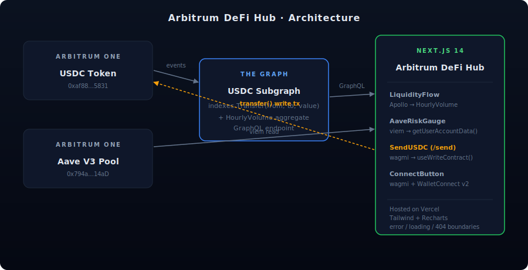

# Arbitrum DeFi Hub

A public **risk & yield monitor** for Arbitrum One with an embedded **agentic
risk advisor**, native **USDC send flow**, and **x402 agentic payments**.
Five on-chain surfaces in one dApp:

- **USDC Transfer Volume** — a custom subgraph indexing USDC `Transfer` events
  on Arbitrum. Volume is pre-aggregated into hourly buckets inside the indexer
  (`HourlyVolume` entity) so the chart loads in a single query.
- **Aave V3 Position Risk** — the connected wallet's live health factor, read
  directly from the Aave V3 Pool contract on Arbitrum, plus a per-asset
  liquidation-price table and an interactive multi-asset price-shock
  simulator.
- **Send USDC** — a full ERC-20 write flow: form validation, balance cap,
  `MAX` button, Arbiscan confirmation link. Built on wagmi v2's
  `useWriteContract` + `useWaitForTransactionReceipt`.
- **Sentinel** — a read-only Anthropic Claude agent with a tool registry that
  reasons over the same on-chain data the UI shows. Health factor, liquidation
  prices, price-shock simulations, and recent Aave activity — all numerically
  grounded, no hallucinated numbers.
- **x402 agentic payments** — paywalled `/api/agent/premium-analysis`
  endpoint settling 0.01 USDC per call on Arbitrum (and Base) via a
  self-hosted EIP-3009 facilitator. Both the user's connected wallet and
  Sentinel's own wallet can pay; settlement tx hash returned in the
  `X-PAYMENT-RESPONSE` header.

Built as a portfolio project that demonstrates a full web3 stack end-to-end:
smart-contract reads *and* writes, two subgraphs on The Graph, wallet
connection, an LLM-powered agent with structured tool use, agentic payments
on EIP-3009, and a polished Next.js frontend with full error / loading
boundaries.


<!-- add a screenshot here once deployed — see docs/SCREENSHOTS.md -->

---

## Architecture

```
┌──────────────────────┐     Transfer events     ┌──────────────────────────┐
│ USDC token contract  │ ──────────────────────▶ │   USDC subgraph          │
│ (Arbitrum One)       │ ◀────── transfer()───── │   Transfer + HourlyVolume│
└──────────────────────┘        write tx         └──────────┬───────────────┘
            ▲                                               │ GraphQL
            │                  ┌──────────────────────┐     │
            │                  │ Aave V3 subgraph     │─────┤
            │                  │ Reserves + DailyStats│     │
            │                  └──────────────────────┘     ▼
            │                                    ┌──────────────────────────┐
┌──────────────────────┐    getUserAccountData   │   Next.js frontend       │
│ Aave V3 Pool (L2)    │ ◀────── viem ─────────  │   (/web)                 │
└──────────────────────┘                         │   · wagmi + WalletConnect│
            ▲                                    │   · Apollo Client        │
            │                                    │   · Recharts             │
            │  EIP-3009 transferWithAuthorization│   · /send write flow     │
            └────────────────────────────────────│   · Sentinel agent       │
                       (x402 facilitator)        │     (Anthropic Claude)   │
                                                 │   · /api/agent/premium-… │
                                                 │     (x402 paywall)       │
                                                 └──────────────────────────┘
```

## Repo layout

```
.
├── subgraph/        # USDC Transfer indexer + HourlyVolume aggregate
├── aave-subgraph/   # Aave V3 Reserves + DailyReserveStat (rates, supply, borrow)
├── web/             # Next.js 14 App Router frontend
│   └── src/lib/x402/  # Self-hosted x402 facilitator + EIP-3009 helpers
└── docs/            # Deploy runbook, screenshot checklist, demo script
```

## Tech stack

| Layer           | Choice                                             |
| --------------- | -------------------------------------------------- |
| Indexer         | The Graph (decentralized network), AssemblyScript  |
| Smart contracts | Aave V3 Pool (read), USDC (read + ERC-20 write + EIP-3009) |
| Frontend        | Next.js 14 (App Router), React 18, TypeScript      |
| Web3            | wagmi v2, viem v2, WalletConnect v2 (Web3Modal)    |
| Data            | Apollo Client (GraphQL), wagmi `useReadContract` / `useWriteContract` |
| Agent           | Anthropic Claude (server-side tool registry, structured tool use) |
| Agentic payments| x402 (HTTP 402 + EIP-3009), self-hosted facilitator |
| Styling         | Tailwind CSS, lucide-react icons                   |
| Charts          | Recharts                                           |
| Deploy          | Vercel (frontend), The Graph Studio (subgraphs)    |

## Getting started

### 1. Clone and install

```bash
git clone https://github.com/<you>/Arbitrum-USDC
cd Arbitrum-USDC
```

### 2. Subgraph

```bash
cd subgraph
npm install
npm run codegen
npm run build
```

To deploy to The Graph's decentralized network, follow the
[deployment runbook](./docs/DEPLOY.md).

### 3. Frontend

```bash
cd ../web
npm install --legacy-peer-deps
cp .env.example .env.local
# fill in NEXT_PUBLIC_WC_PROJECT_ID, NEXT_PUBLIC_GRAPH_API_KEY,
# NEXT_PUBLIC_USDC_SUBGRAPH_URL, NEXT_PUBLIC_AAVE_SUBGRAPH_URL,
# NEXT_PUBLIC_ARBITRUM_RPC_URL
npm run dev
```

Open <http://localhost:3000>.

## Deployment

See [`docs/DEPLOY.md`](./docs/DEPLOY.md) for the full 8-step runbook (subgraph
deploy → WalletConnect project → Vercel).

## Features

- **Dashboard (`/`):** Aave V3 risk gauge + USDC hourly volume chart, both
  driven by live on-chain data.
- **Portfolio (`/portfolio`):** live Aave V3 health factor, per-asset
  liquidation prices, and an interactive multi-asset price-shock simulator.
  Spectator mode (`?address=0x…`) reads any wallet without needing a
  connection.
- **Send USDC (`/send`):** signed ERC-20 transfer with input validation,
  `MAX` balance shortcut, and Arbiscan confirmation link.
- **Sentinel agent:** server-side Anthropic Claude with a tool registry —
  health factor, liquidation prices, price-shock simulations, recent Aave
  activity, premium analysis. Numerically grounded; the agent reads the
  same on-chain data the UI shows. Floating "Ask Sentinel" launcher on
  every page.
- **x402 agentic payments:** paywalled `/api/agent/premium-analysis`
  endpoint settling 0.01 USDC per call on Arbitrum (and Base). Self-hosted
  facilitator (`/api/x402/verify`, `/api/x402/settle`) that recovers the
  EIP-3009 signature, checks the on-chain `authorizationState` nonce, and
  submits `transferWithAuthorization` paying gas from the facilitator
  wallet. Both the user's connected wallet and Sentinel's own wallet can
  pay; the settlement tx hash is returned in the `X-PAYMENT-RESPONSE`
  header.
- **Wallet connect** via WalletConnect v2 / Web3Modal, including account view
  and disconnect.
- **Indexer-side aggregation:** the subgraph writes a `HourlyVolume` bucket on
  every `Transfer`, so the frontend makes one query instead of paginating
  thousands of events in the browser.
- **Direct contract reads:** Aave V3 health factor comes from
  `getUserAccountData` via viem — no need to replicate Aave's health-factor
  math client-side.
- **Graceful UX:** empty / loading / error boundaries everywhere (no wallet,
  no position, subgraph down, RPC error, user-rejected tx…). Custom
  `app/error.tsx`, `loading.tsx`, `not-found.tsx`.

## Docs

- [`docs/DEPLOY.md`](./docs/DEPLOY.md) — step-by-step deploy runbook.
- [`docs/SCREENSHOTS.md`](./docs/SCREENSHOTS.md) — the six screenshots to
  capture for the portfolio README.
- [`docs/DEMO_SCRIPT.md`](./docs/DEMO_SCRIPT.md) — 28-second screen-recording
  storyboard.
- [`docs/LINKEDIN_POST.md`](./docs/LINKEDIN_POST.md) — three portfolio post
  drafts (concise / story-led / technical).

## Roadmap / nice-to-haves

- Second market pane: GMX open interest or Uniswap v3 pool TVL on Arbitrum.
- Historical HF sparkline — requires indexing Aave `Supply` / `Borrow` /
  `Repay` events in the existing `aave-subgraph`.
- Multi-chain: add Base or Optimism USDC as a network switcher (the x402
  facilitator already supports Base).
- ENS resolution on the Send recipient field.
- Tiered x402 paywall: cheaper price for the basic shock matrix, premium
  price for a Claude-narrated risk report.

## Manual cleanup (if you reorganized from the original flat layout)

If you still see `./abis/`, `./build/`, `./generated/`, `./node_modules/`,
`./src/`, or stale `./package.json` / `./package-lock.json` at the repo root:
they're leftover from the old flat layout. Close VS Code and any `hardhat` /
`graph` processes, then delete them — everything live now lives inside
`subgraph/` or `web/`.

## License

MIT
